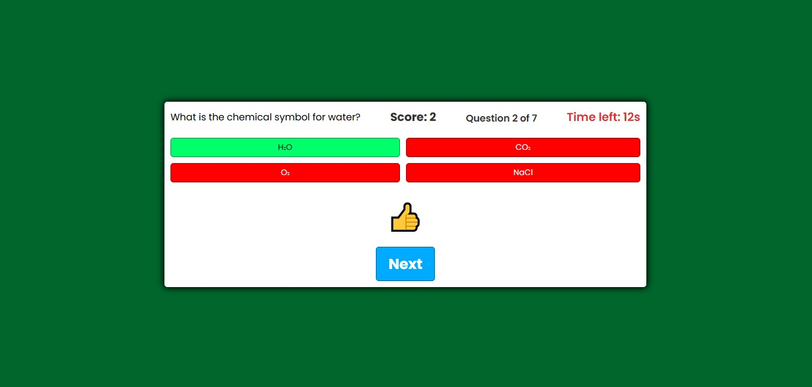

# Quiz App

A simple quiz application built with **JavaScript**, **HTML**, and **CSS**. Created as a student project to practice core front-end development skills. I am learning how to work with the DOM, timers, dynamic content, and basic game logic in JavaScript.

## Features

* Randomized multiple-choice questions  
* Countdown timer for each question  
* Sound effects for correct and incorrect answers  
* Progress tracking and final score summary
* Visual feedback with emoji animations 
* Fully responsive design

## Technologies Used

* JavaScript (DOM manipulation, event handling, timers)
* HTML5 & CSS3 (semantic layout and styling)
* Audio API (`=<audio>` tag, playback controls)

## What i learned

* Working with JavaScript event listeners and buttons
* Shuffling questions and managing user input
* Creating timers using setInterval and clearInterval
* Dynamically updating the DOM
* Implementing visual feedback and basic UX elements

## Here is an example:

## Here's what the quiz looks like in action:

[https://anina1999.github.io/Quiz-app/](https://anina1999.github.io/Quiz-app/)

## LICENSE

This project is open for educational use and personal learning.
